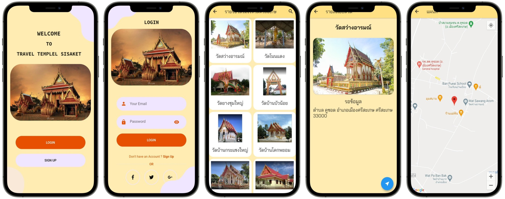

# SimpleToDoList

พัฒนาโดย

นายสราวุธ ศรีพรม

นางสาวกนกวรรณ สุดอนุ

นางสาวกัลยา กวดขันธ์

นางสาววราภรณ์ ทองมนต์

นายณรงค์เดช เพ็งแจ่ม

นักศึกษาสาขาวิทยาการคอมพิวเตอร์

คณะศิลปศาสตร์และวิทยาศาสตร์ มหาวิทยาลัยราชภัฏศรีสะเกษ

**Description:**

โปรแกรมท่องเที่ยววัดในจังหวัดศรีสะเกษ เป็นโปรแกรมเพื่อใช้สำหรับการค้นหาข้อมูลแหล่งท่องเที่ยววัดในจังหวัดศรีสะเกษ โดยการอ่านJson เพื่อใช้ในการแสดงผลข้อมูลที่เราค้นหา

เข้าใจในเรื่องการสร้างข้อมูลให้อยู่ในรูปแบบโครงสร้างของ Json และการอ่าน ไฟล์ในโมบายแอปพลิเคชั่น

โมบายแอปพลิเคชั่นนี้พัฒนาขึ้นเพื่อใช้เป็นตัวอย่างในกรณีศึกษาการพัฒนาโมบายแอปพลิเคชั่นด้วย Flutter ในรายวิชาการพัฒนาแอปพลิเคชั่นบนมือถือ เพื่อให้ได้ใช้สำหรับการศึกษา ทดลองปฏิบัติตาม ให้เกิดความรู้ ความเข้าใจ และทักษะในการพัฒนาโปรแกรมบนมือถือด้วย Flutter

โปรแกรมท่องเที่ยววัดในจังหวัดศรีสะเกษ ประกอบด้วย 6 หน้า ได้แก่

1.หน้า WElCOME TO TRAVEL TEMPLEL SISAKET

2.หน้า LOGIN

3.หน้า SIGN UP

4.หน้ารายชื่อวัด

5.หน้าข้อมูล

6.หน้าGoogle Map

**Packages we are using:**

- fluuter: [link](https://pub.dev/packages/flutter_svg)

- http: [link](https://pub.dev/packages/http)

- geolocator: [link](https://pub.dev/packages/geolocator)

- google_maps_flutter: [link](https://pub.dev/packages/google_maps_flutter)

- flutter_search_Bar: [link](https://pub.dev/packages/flutter_search_bar)

- google_fonts: [link](https://pub.dev/packages/google_fonts)

## การอ่านไฟล์Json

```dart

    class TravelPageState extends State<TravelPage> {
    var jsonData;
    List<TempleData> templeList = [];
    Future<String> getTravelAPI() async {
    var response = await Http.get('https://sarawut1107.github.io/templel/templel.json');

    jsonData = json.decode(utf8.decode(response.bodyBytes));
    for (var item in jsonData) {
      TempleData templeData = TempleData(
          item['order'],
          item['name'],
          item['maestro'],
          item['detail'],
          item['latitude'],
          item['longitude'],
          item['img']);
      templeList.add(templeData);
    }

    return 'jsonData';

    }
        child: FutureBuilder(
          future: _getTravelAPI(),
          builder: (context, snapshot) {
            if (snapshot.hasData) {
                itemCount: templeListShow.length,
                    child: InkWell(
                      child: Column(
                        children: [
                          Container(
                            padding: EdgeInsets.all(10.0),
                            decoration: ShapeDecoration(
                              shape: RoundedRectangleBorder(
                                borderRadius: BorderRadius.vertical(
                                  top: Radius.circular(200),
                                ),
                              ),
                            ),
                            child: Image.network(
                              "${templeListShow[index].img}",
                              height: 120,
                              fit: BoxFit.cover,
                            ),
                          ),
                          SizedBox(
                            height: 10,
                          ),
                          ListView(
                            shrinkWrap: true,
                            children: [
                              Container(
                                alignment: FractionalOffset.center,
                                width: double.infinity,
                                child: Text(
                                  "${templeListShow[index].name}",
                                  style: bulletStyle,
                                ),
                              )
                            ],
                          )
                        ],
                      ),
                    ),
                  );
                },
              );
            } else {
              return Center(
                child: Column(
                  mainAxisAlignment: MainAxisAlignment.center,
                  children: <Widget>[
                    CircularProgressIndicator(),
                  ],
                ),
              );
            }
          },
        ),
      ),
    );
    }
    }

    class TempleData {
    int order;
    String name;
    String maestro;
    String detail;
    double latitude;
    double longitude;
    String img;

    TempleData(
    this.order,
    this.name,
    this.maestro,
    this.detail,
    this.latitude,
    this.longitude,
    this.img,
    );
    }
```

## การส่งข้อมูลระหว่างหน้า

ข้อมูลหน้าแรก(index or travel_screen) ไปยังหน้าที่2 (travel_view)

    onTap: () {
                        Navigator.push(
                          context,
                          MaterialPageRoute(
                            // ignore: missing_required_param
                            builder: (context) => TravelViewPage(
                              name: templeListShow[index].name,
                              maestro: templeListShow[index].maestro,
                              detail: templeListShow[index].detail,
                              img: templeListShow[index].img,
                              latitude: templeListShow[index].latitude,
                              longitude: templeListShow[index].longitude,
                            ),
                          ),
                        );
                      },

## การส่งข้อมูลระหว่างหน้า

ข้อมูลหน้าที่2(travel_view) ไปยังหน้าที่3 (google_maps)

การดึงข้อมูลระหว่างที่เป็นตัวเลขทศนิยม(doubel) จะไม่ใช้ latitude: '${widget.latitude}', แต่จะใช้คำสั่ง latitude: widget.latitude,

    onPressed: () {
          Navigator.push(
            context,
            MaterialPageRoute(
              // ignore: missing_required_param
              builder: (context) => MapPage(
                name: '${widget.name}',
                latitude: widget.latitude,
                longtide: widget.longitude,
              ),
            ),
          );
        },

## แสดงหน้า Google_Maps

    class MapPage extends StatefulWidget {
        List<TempleData> templeListShow = [];
        List<TempleData> templeList = [];

        final String name;
        final latitude;
        final longtide;

        MapPage({
        Key key,
        this.name,
        @required this.latitude,
        @required this.longtide,
        }) : super(key: key);

        \_MapPageState createState() => \_MapPageState();
    }
    class _MapPageState extends State<MapPage> {
        List<TempleData> templeList = [];
        Position userLocation;
        GoogleMapController mapController;
        LatLng position;
        Map<String, Marker> _markers = {};

        void _onMapCreated(GoogleMapController controller) {
        mapController = controller;
        }

        Future<Position> _getlocation() async {
          try {
            userLocation = await Geolocator.getCurrentPosition(
          desiredAccuracy: LocationAccuracy.best);
          } catch (e) {
             userLocation = null;
         }
         return userLocation;
        }
    @override
    Widget build(BuildContext context) {
        position = LatLng(widget.latitude, widget.longtide);

        final marker = new Marker(
        markerId: MarkerId('Hello'),
        position: position,
        infoWindow: InfoWindow(
        title: '${widget.name}',
        // snippet: history.date,
        ),
     );
     _markers["0"] = marker;

        return Scaffold(
         appBar: AppBar(
            title: Text(
            'แผนที่',
            style: GoogleFonts.baiJamjuree(),
            ),
        ),
       body: FutureBuilder(
            future: _getlocation(),
            builder: (BuildContext context, AsyncSnapshot snapshot) {
                if (snapshot.hasData) {
                return GoogleMap(
                    mapType: MapType.normal,
                    onMapCreated: _onMapCreated,
                    myLocationEnabled: true,
                    initialCameraPosition: CameraPosition(target: position, zoom: 15),
                    markers: _markers.values.toSet(),
                );
            } else {
                return Center(
                child: Column(
                    mainAxisAlignment: MainAxisAlignment.center,
                    children: <Widget>[CircularProgressIndicator()],
                    ),
                   );
                  }
                 },
                ),
               );
              }
            }

## ตัวอย่างหน้าจอ


